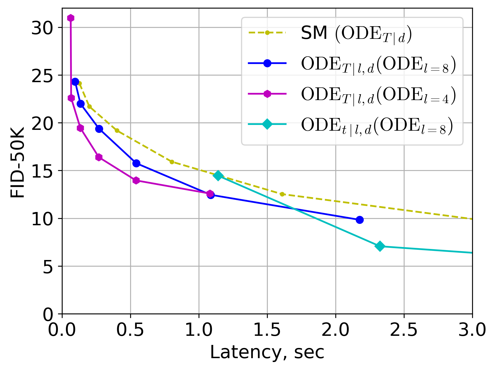

## $\textrm{ODE}_t \left(\textrm{ODE}_l \right)$: Shortcutting the Time and Length in Diffusion and Flow Models for Faster Sampling

### Abstract
Recently, continuous normalizing flows (CNFs) and diffusion models (DMs) have been studied using the unified theoretical framework. Although such models can generate high-quality data points from a noise distribution, the sampling demands multiple iterations to solve an ordinary differential equation (ODE) with high computational complexity. Most existing methods focus on reducing the number of time steps during the sampling process to improve efficiency. In this work, we explore a complementary direction in which the quality-complexity tradeoff can be dynamically controlled in terms of time steps and in the length of the neural network. We achieve this by rewiring the blocks in the transformer-based architecture to solve an inner discretized ODE w.r.t. its length. Then, we employ time- and length-wise consistency terms during flow matching training, and as a result, the sampling can be performed with an arbitrary number of time steps and transformer blocks. Unlike others, our $\textrm{ODE}_t \left(\textrm{ODE}_l \right)$ approach is solver-agnostic in time dimension and decreases both latency and memory usage. Compared to the previous state of the art, image generation experiments on CelebA-HQ and ImageNet show a latency reduction of up to $3\times$ in the most efficient sampling mode, and a FID score improvement of up to $3.5$ points for high-quality sampling. We release our code and weights with fully reproducible experiments in this repo.



### Using the code
We recommend using [mamba or micromamba](https://mamba.readthedocs.io/en/latest/). If prefer conda then use `conda` in place of `micromamba`.
``` cmd
micromamba env create -f environment.yml
pip install -U "jax[cuda12]"==0.5.3
pip install -r requirements.txt
```
This codebase is written in JAX and was checked on A6000/H100 GPUs. The commands above install the mamba/conda dependencies from `environment.yml` and `requirements.txt`. To load datasets, we use [TFDS](https://github.com/kvfrans/tfds_builders).

Use the first command to train a DiT-B model with $\textrm{ODE}_t \left(\textrm{ODE}_l \right)$ shortcuts on CelebA-HQ. Then, evaluate by passing the number of active blocks using the `model.depthwise L` argument:
```
python train.py --mode train --model.lr 1e-4/1e-5 --model.bootstrap_cfg 0 --model.dropout 0.1 --model.class_dropout_prob 1 --model.num_classes 1 --model.depth_wise 12 --model.depth_group 4 --model.cfg_scale 0 --batch_size 256 --model.train_type shortcut --save_dir ckpts/celeba-shortcut-odelt --load_dir ckpts/celeba-shortcut2-every4400001 --max_steps 100_000 --eval_interval 250000 --save_interval 50000 --fid_stats data/celebahq256_fidstats_jax.npz --dataset_name celebahq256
python train.py --mode eval --model.depth_wise 4/8/12 --model.num_classes 1 --model.depth_group 4 --batch_size 256 --model.train_type shortcut --fid_stats data/celebahq256_fidstats_jax.npz --dataset_name celebahq256 --load_dir celeba-shortcut-odelt.pkl
```
or on Imagenet-256:
``` 
python train.py --mode train --model.lr 1e-4/1e-5 --model.bootstrap_cfg 1 --model.dropout 0.0 --model.class_dropout_prob 0.1 --model.num_classes 1000 --model.depth_wise 12 --model.depth_group 4 --model.cfg_scale 1.5 --batch_size 256 --model.train_type shortcut --save_dir ckpts/imagenet-shortcut-odelt --load_dir ckpts/imagenet-shortcut2-b-fulldata800001 --max_steps 100_000 --eval_interval 250000 --save_interval 50000 --fid_stats data/imagenet256_fidstats_jax.npz --dataset_name imagenet256
python train.py --mode eval --model.depth_wise 4/8/12 --model.num_classes 1000 --model.depth_group 4 --batch_size 256 --model.train_type shortcut --fid_stats data/imagenet256_fidstats_jax.npz --dataset_name imagenet256 --load_dir imagenet-shortcut-odelt.pkl
```

A larger DiT-XL scale model can be trained/evaluated via:
``` 
python train.py --mode train --model.lr 1e-4/1e-5 --model.bootstrap_cfg 1 --model.dropout 0.0 --model.class_dropout_prob 0.1 --model.num_classes 1000 --model.depth_wise 28 --model.depth_group 8 --model.cfg_scale 1.5 --batch_size 256 --model.train_type shortcut --save_dir ckpts/xlimagenet-shortcut-odelt --load_dir ckpts/imagenet-shortcut2-xl-fulldata-continue200000 --max_steps 100_000 --eval_interval 250000 --save_interval 50000 --fid_stats data/imagenet256_fidstats_jax.npz --dataset_name imagenet256 --model.hidden_size 1152 --model.depth 28 --model.num_heads 16 --model.depth_min 12
python train.py --mode eval --model.depth_wise 12/20/28 --model.num_classes 1000 --model.depth_group 8 --batch_size 64 --model.train_type shortcut --fid_stats data/imagenet256_fidstats_jax.npz --dataset_name imagenet256 --load_dir xlimagenet-shortcut-odelt.pkl --model.hidden_size 1152 --model.depth 28 --model.num_heads 16 --model.depth_min 12
```

### More flows and ODE solvers
- To train a regular flow model instead, use `--model.train_type naive/fm/icfm/rfm` where `targets_cfm.py` corresponds to reimplementation of the [PyTorch CFM library](https://github.com/atong01/conditional-flow-matching).
- To use any adaptive-step ODE solver from [diffrax](https://github.com/patrick-kidger/diffrax) or any other sampling setting, look at `helper_inference.py`.

### Checkpoints and FID Stats
- [SM](https://github.com/kvfrans/shortcut-models/) checkpoints and precomputed reference FID stats for CelebA and ImageNet can be downloaded from [their gdrive](https://drive.google.com/drive/folders/1g665i0vMxm8qqqcp5mAiexnL919-gMwW?usp=sharing).
- Our checkpoints, and precomputed reference FID stats for CelebA and ImageNet can be downloaded from [this gdrive](https://drive.google.com/drive/folders/1ZzWY9jZBRXKiyTnTG-ZWiWAd4w2PEDIZ?usp=sharing).

## 📌 Citation
If you find this work useful for your research, please consider citing it:
```bibtex
@article{odelt,
  title={$\textrm{ODE}_t \left(\textrm{ODE}_l \right)$: Shortcutting the Time and Length in Diffusion and Flow Models for Faster Sampling}, 
  author={Denis Gudovskiy and Wenzhao Zheng and Tomoyuki Okuno and Yohei Nakata and Kurt Keutzer},
  journal={arXiv preprint arXiv:2506.21714},
  year={2025}
}
```
